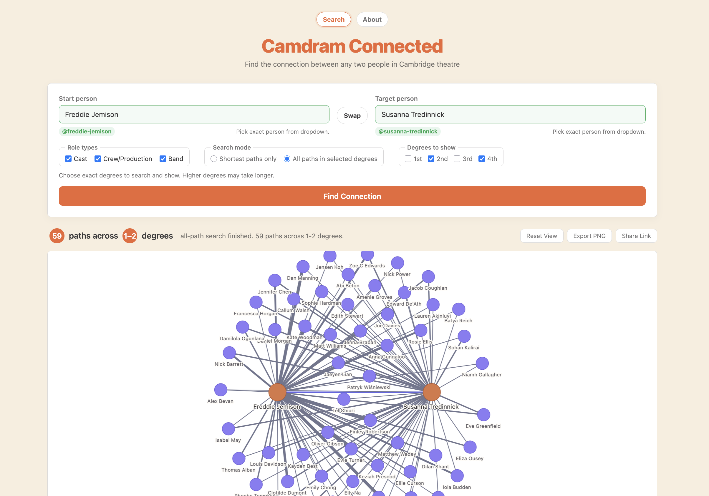

# Camdram Connected

<p align="center">
  
</p>

Find shortest route between any two people in Cambridge theatre.

`Camdram Connected` turns Camdram credits into explorable graph: people, shows, roles, shared history. Type two names, hit search, get clean visual path through Cambridge theatre network.

## Why it feels good

- Fast autocomplete for exact Camdram people selection
- Shortest-path mode for quick answers
- All-path mode for digging through every route at chosen degree depth
- Role filters for `cast`, `prod`, and `band`
- Interactive graph with pan, zoom, highlight, reset, and PNG export
- Share links with names preloaded
- Live progress UI with depth, cache, show, and path counters

## Stack

- Vanilla HTML, CSS, JavaScript
- `vis-network` for graph rendering
- Cloudflare Pages for hosting
- Cloudflare Pages Function at `functions/api/[[path]].js` for Camdram CORS proxying and edge caching

No build step. Static site plus lightweight serverless proxy.

## Run locally

Use Wrangler so `/api/*` proxy works:

```sh
npx wrangler pages dev . --port 8788
```

Open `http://localhost:8788`.

Plain static server will not work here. Camdram API does not send browser-friendly CORS headers, so app depends on local Pages Function.

## Deploy

Cloudflare Pages picks this repo up without build config.

```sh
npx wrangler pages deploy . --project-name=camdram-connected
```

Or connect repo in Cloudflare dashboard and use `/` as output directory.

## Search model

1. User selects two exact people from Camdram autocomplete.
2. App fetches roles, then expands outward through shared shows.
3. Breadth-first search finds minimum-degree connections in shortest-path mode.
4. Exhaustive mode keeps collecting all valid routes at selected depths.
5. Results render as graph plus step-by-step connection detail.

## Data source

Public Camdram endpoints used by app:

| Endpoint | Purpose |
| --- | --- |
| `GET /people.json?q={query}` | Search people by name |
| `GET /people/{slug}/roles.json` | Load one person's credits |
| `GET /shows/{slug}/roles.json` | Load one show's credits |

Role types supported: `cast`, `prod`, `band`.
